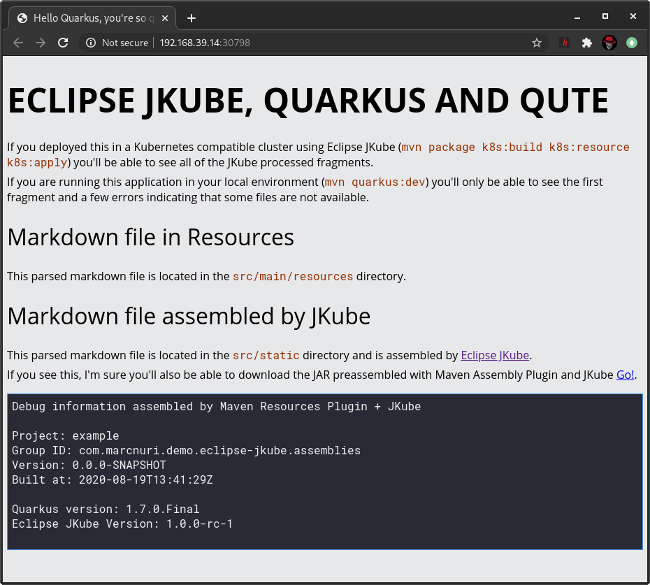
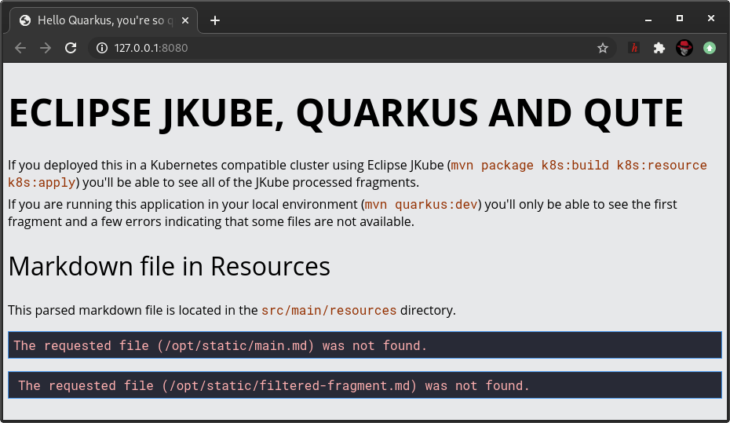

# Application showcasing Quarkus with Qute, Eclipse JKube and Maven Assemblies

## How to run

### Cloud

I designed this application to be deployed into Kubernetes, some features won't be available
if you don't stick to the following procedure.

Minikube is a recommended requirement since we will be pushing the Docker image to the shared
Docker registry so that we don't have to push it to a public or remote registry. Notice that
a regular K8s cluster can be used but then you'll have to push your image too (`mvn k8s:push`).

```shell script
# Access to Minikube's Docker Daemon
$ eval $(minikube docker-env)
# Package, build Docker Image, generate resource manifests, and apply them to the cluster
$ mvn package k8s:build k8s:resource k8s:apply
# Open exposed service in browser
$ minikube service example
```

If everything goes as expected a browser window should open and we should see the following:


We can now clean up the resources in the cluster by running:

```shell script
$ mvn k8s:undeploy
```

### Local

You can run the application locally, but some features provided
by the JKube Assembly integration won't be visible.

```shell script
$ mvn clean quarkus:dev
```

Once the application is ready, we can open our browser to [http://127.0.0.1:8080](http://127.0.0.1:8080).




